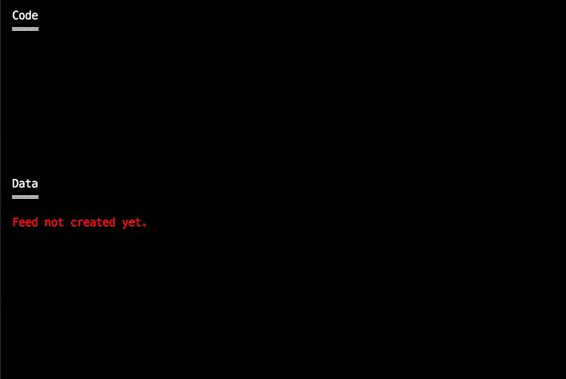

# Log-structured data with hypercore

The fundamental building block of the Dat ecosystem is **hypercore**.

* **hypercore**: [mafintosh/hypercore](https://github.com/mafintosh/hypercore)

It is a Javascript library that implements an immutable, append-only log.

Fundamentally, it is just a super simple database for storing and retrieving
data.

Even though it is simple and has limited operations it can perform, it is an
ideal building block for more complicated abstractions, as you will see.

# Adding data

Hypercore only supports a single write operation: **append** to add data to
the end of the log.

Note: A hypercore log is often referred to as a *feed*.

Data is stored sequentially with a simple incrementing integer index. The first
data you append will be stored at index 0, the next at index 1, and so on.

No other write operations are allowed. Once you append data, you cannot modify
it, or delete it. However, it is possible to clear data from your local cache.

# Retrieving data

Once the data is stored, the data from any index can be retrieved using the
**get** method. Hypercore supports *random access* reads, so you can retrieve
data in any order.

# Summary

Pretty simple, huh? You can only append data, and then you read back the data
in any order. On the next page, we'll talk about the superpowers that make
hypercore special.
